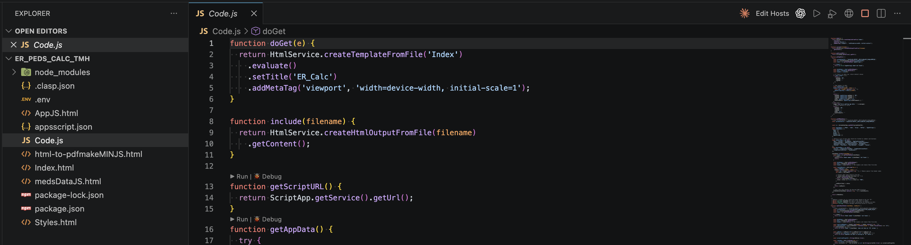

# GAS Fakes for VS Code

Run, debug, and serve Google Apps Script projects locally — no `clasp run`, no deploy, no serverless round-trip.

This extension wires [`@mcpher/gas-fakes`](https://www.npmjs.com/package/@mcpher/gas-fakes) into a VS Code workflow for [clasp](https://github.com/google/clasp)-managed projects. You get one-click run, breakpoint-debug in `.gs` files, and a local web-app server that mimics Apps Script's sandboxed iframe model — so what you build on your laptop behaves like what gets deployed.

Built for the workflow described in [Gas-fakes, GitHub Actions, and WIF](https://ramblings.mcpher.com/gas-fakes-github-actions-wif/).



---

## Features

- **▶ Run Function** — pick any zero-arg top-level function and execute it under `@mcpher/gas-fakes`, with output streaming into a dedicated VS Code channel.
- **🐞 Debug Function** — hit breakpoints in your `.gs` files; stack traces reference real file paths, not eval'd buffers.
- **🌐 Serve Web App** — `doGet(e)` renders into a sandboxed `<iframe>`, `google.script.run` calls bridge over postMessage, file uploads work end-to-end. Defaults match Apps Script's runtime sandbox so apps don't behave differently locally.
- **CodeLens** above each runnable function — `▶ Run | 🐞 Debug` without the command palette.
- **Editor title bar buttons** when you're in a clasp project: `▶ 🐞 🌐 ⏹` for fast access.
- **`.gs` files** registered as JavaScript — syntax highlighting, IntelliSense, the works.
- **Auth helper** — reads `oauthScopes` from `appsscript.json` and your custom OAuth client from `.env`, then runs `gcloud auth application-default login` with all the right flags.

---

## Requirements

- **Node.js 18+** on `PATH` (or set `gasFakes.nodeBinary`).
- **gcloud CLI** — install via `brew install --cask google-cloud-sdk` or from [Google Cloud SDK](https://cloud.google.com/sdk/docs/install). Only needed if your script touches Google services (Sheets, Drive, etc.).
- **A clasp project** — `.clasp.json` in the workspace.
- **Auth setup** — see [Authentication](#authentication-the-real-setup) below. This is the hardest part, but you only do it once.

---

## Quick start

If you already have `gcloud` set up and just want to test a script that doesn't touch Google services:

1. Open your clasp project in VS Code.
2. **Cmd+Shift+P → GAS Fakes: Init in This Project**.
3. **Cmd+Shift+P → GAS Fakes: Run Function** → pick a function.

For a script that reads/writes a Google Sheet, jump to [Authentication](#authentication-the-real-setup).

---

## Authentication: the real setup

`@mcpher/gas-fakes` runs your code outside Google's sandbox, so it has to authenticate to Sheets, Drive, etc. **the same way any third-party app would** — via OAuth. There are two paths:

### Path A — Personal Google account (most users)

This works for `@gmail.com` accounts and for any project where you can create a GCP project under your own ownership.

#### One-time GCP setup

1. **Create or select a GCP project**: https://console.cloud.google.com/projectcreate
2. **Enable the APIs your script uses**, e.g.:
   - https://console.cloud.google.com/apis/library/sheets.googleapis.com → **Enable**
   - https://console.cloud.google.com/apis/library/drive.googleapis.com → **Enable**
3. **Configure the OAuth consent screen**: https://console.cloud.google.com/apis/credentials/consent
   - **User Type**: "External" (Gmail) or "Internal" (Workspace).
   - Fill in app name, user-support email, developer-contact email. Skip the scopes page.
   - **Test users** page: add your own Gmail. Save.
4. **Create a Desktop OAuth client**: https://console.cloud.google.com/apis/credentials
   - **Create Credentials → OAuth client ID → Desktop app**.
   - Click the download icon next to the client. Save the JSON somewhere stable, e.g.:
     ```
     mkdir -p ~/.config/gas-fakes
     mv ~/Downloads/client_secret_*.json ~/.config/gas-fakes/client.json
     ```

> **Why a custom OAuth client?** Google blocks the default `gcloud` CLI client from requesting Workspace scopes (Sheets, Drive, Gmail). You have to bring your own.

#### Per-project setup

1. **Init**: `Cmd+Shift+P → GAS Fakes: Init in This Project`. This installs `@mcpher/gas-fakes` and creates `.env` configured for ADC auth.
2. **Edit `.env`** in the project root:
   ```ini
   AUTH_TYPE="adc"
   GOOGLE_CLOUD_PROJECT="your-gcp-project-id"
   CLIENT_CREDENTIAL_FILE="/Users/you/.config/gas-fakes/client.json"
   EXTRA_SCOPES="https://www.googleapis.com/auth/spreadsheets,https://www.googleapis.com/auth/drive"
   ```
   (`EXTRA_SCOPES` should match your code's needs. The list above covers Sheets + Drive.)
3. **Add `oauthScopes` to `appsscript.json`**:
   ```json
   {
     "oauthScopes": [
       "https://www.googleapis.com/auth/userinfo.email",
       "https://www.googleapis.com/auth/userinfo.profile",
       "https://www.googleapis.com/auth/script.scriptapp",
       "https://www.googleapis.com/auth/spreadsheets",
       "https://www.googleapis.com/auth/drive"
     ]
   }
   ```
4. **Sign in**: `Cmd+Shift+P → GAS Fakes: Sign In (ADC)`. The extension reads your manifest scopes and `CLIENT_CREDENTIAL_FILE`, then runs `gcloud auth application-default login --scopes=… --client-id-file=…`. The browser consent screen will ask for Sheets/Drive access.
5. **Run** or **Serve Web App**.

#### Adding more test users (if "App is being tested" error)

If you see *"Project Name has not completed the Google verification process"*:
- https://console.cloud.google.com/apis/credentials/consent → scroll to **Test users** → **+ ADD USERS** → add the Gmail you're signing in with.

You can add up to 100 test users. Personal dev never needs to "publish" the app for verification.

---

### Path B — Enterprise Workspace, locked-down GCP Console

If your IT department blocks `console.cloud.google.com` or you can't create OAuth clients, you have three options:

1. **Domain-Wide Delegation (DWD)** — ask IT to create a service account with DWD authorized for your needed scopes; they hand you a service-account JSON key. Set `AUTH_TYPE="dwd"` in `.env` and point `gas-fakes` at the key. (See the [original article](https://ramblings.mcpher.com/gas-fakes-github-actions-wif/) for the full IT request template.)
2. **Personal Google account workaround** — share your work spreadsheets to a personal Gmail, then use Path A. Works for read-mostly scenarios.
3. **Local fixture** — replace `SpreadsheetApp.openById(...)` with a JSON fixture for development. Fast, but not exercising the real Sheets path.

---

## Daily usage

Once auth is set up:

| Action | How |
|---|---|
| Run a function | Click **▶** in the editor title bar, the **▶ Run** CodeLens above the function, or **GAS Fakes: Run Function** in the palette |
| Debug a function | Click **🐞** title bar / CodeLens — set breakpoints in `.gs` first |
| Serve a web app | Click **🌐** title bar — opens `http://127.0.0.1:<port>/` in your browser, streams logs to the GAS Fakes output channel |
| Stop the server | Click **⏹** (only visible while serving) |

The editor title-bar buttons appear on any `.gs`/`.js` file in a clasp project. The CodeLens lenses appear above each zero-arg top-level function.

---

## How `Serve Web App` works

The local server replicates Apps Script's runtime architecture, not just its API surface:

```
┌────────────────────────────────────────────────────────────────┐
│ Outer frame  http://127.0.0.1:<port>/                          │
│                                                                │
│  ┌──────────────────────────────────────────────────────────┐  │
│  │ <iframe sandbox="allow-scripts allow-same-origin …">     │  │
│  │ Inner frame  /_inner/  ── doGet(e) output rendered here  │  │
│  │                                                          │  │
│  │  google.script.run.foo(args)                             │  │
│  │      └─ postMessage({type:'run', ...}) → outer parent ──┐│  │
│  └──────────────────────────────────────────────────────────┘  │
│                                                              │ │
│  outer parent:                                               │ │
│   onmessage → fetch('/_gasfakes/run/foo', {method:'POST',…}) ┘ │
└────────────────────────────────────────────────────────────────┘
                              │
                              ▼
                ┌──────────────────────────┐
                │ Node child process       │
                │  • @mcpher/gas-fakes     │
                │  • HtmlService shim      │
                │  • busboy multipart      │
                │  • global[fnName](args)  │
                └──────────────────────────┘
```

- **Inner frame is sandboxed** — your HTML can't escape into the parent. Mirrors how production GAS isolates user content.
- **`google.script.run.foo(blob)`** with a `File`/`Blob` arg auto-detects, transfers via structured clone over postMessage, and the parent re-encodes as multipart so the server can call your function with a GAS-Blob-shaped object (`getBytes()`, `getName()`, `getContentType()`, `getDataAsString()`).
- **Scriptlets** (`<?= ?>`, `<?!= ?>`, `<? ?>`) are processed against the same global scope as your `.gs` files. `include('PartialName')` works the same as in real GAS.
- **`HtmlService.createTemplateFromFile / createHtmlOutputFromFile`** read from the project's `rootDir` (per `.clasp.json`).

---

## Settings

| Setting | Default | What it does |
|---|---|---|
| `gasFakes.nodeBinary` | `"node"` | Path to the Node.js binary used to run the runner. |
| `gasFakes.entryFunctionPattern` | regex | Match for runnable zero-arg top-level functions. |
| `gasFakes.sandboxIframe` | `true` | Serve web app inside a sandboxed iframe with postMessage bridging. Set `false` to serve the user HTML directly (less faithful to GAS but simpler). |
| `gasFakes.codeLens.enabled` | `true` | Show ▶ Run / 🐞 Debug above functions. |

---

## Troubleshooting

### "no .clasp.json found in this workspace"
The extension looks for `.clasp.json` from the active editor up to the workspace root. If you opened a single file instead of a folder, open the project directory.

### "cannot find @mcpher/gas-fakes in this project"
Run **GAS Fakes: Init in This Project**. The extension installs `@mcpher/gas-fakes` from a private cache (`~/.cache/gas-fakes-npm`) so a broken `~/.npm` cache won't sink the install.

### "Request had insufficient authentication scopes"
The ADC token doesn't have the scopes your code needs. Three things to check:
1. `appsscript.json` lists the scopes under `oauthScopes`.
2. `.env` has `EXTRA_SCOPES` set to the same scopes.
3. You re-ran **Sign In (ADC)** after editing the manifest — the scopes only flow through at sign-in time.

### "App has not completed Google verification"
The OAuth consent screen is in "Testing" mode (which it always is for personal projects). Add yourself as a test user: https://console.cloud.google.com/apis/credentials/consent → **Test users → + ADD USERS**.

### "An iframe which has both allow-scripts and allow-same-origin can escape its sandboxing"
Harmless Chrome warning. We need both flags so user code runs and can use `localStorage`. Real GAS achieves the same effect by serving the inner iframe from a different domain (`userContent.googleusercontent.com`); locally we don't have that option.

### "ScriptApp.getService is not a function"
Older bundle. The current runner stubs `ScriptApp.getService().getUrl()` to return the local server URL. Reload the Extension Development Host (Cmd+R) and rebuild.

### `EACCES` errors on `~/.npm`
Old npm bug — fix with `sudo chown -R "$(id -u):$(id -g)" ~/.npm`. The extension's Init command sidesteps this by using `~/.cache/gas-fakes-npm` as the npm cache, but every other npm tool you run will keep failing until you chown.

### Web app loads but data is empty
Most likely the spreadsheet isn't accessible to whichever account you authenticated with. Open the sheet and confirm your signed-in Gmail is in the share list.

---

## Limitations

- **Zero-argument entry points only** for Run/Debug. The web-app `doGet(e)` does receive a synthesized event, including query parameters.
- **`google.script.run` argument types** — JSON-serializable values, plus `File`/`Blob`. `Date` objects round-trip via JSON so they arrive as strings (same as real GAS).
- **Scope inference** — Apps Script's editor auto-infers scopes from your code at deploy time. We don't do that — list scopes explicitly in `appsscript.json`.
- **Some `HtmlService` chain methods are no-ops** — `setXFrameOptionsMode`, `setSandboxMode`, `setWidth`, `setHeight`. Real GAS uses these for security and dialog sizing; locally we serve the iframe full-viewport.
- **Stack traces** point at real `.gs` files (good), but `vm.Script` line numbers can drift a few lines from what you see in the editor when the file uses unusual whitespace.

---

## Architecture

```
┌────────────── VS Code (extension host) ──────────────┐
│  src/                                                │
│   ├─ extension.ts              Activation + wiring   │
│   ├─ projectResolver.ts        .clasp.json discovery │
│   ├─ functionIndexer.ts        Top-level fn parser   │
│   ├─ codeLens.ts               ▶ Run / 🐞 Debug      │
│   ├─ context.ts                Title-bar visibility  │
│   └─ commands/                                       │
│       ├─ init.ts                                     │
│       ├─ signIn.ts                                   │
│       ├─ runFunction.ts                              │
│       ├─ debugFunction.ts                            │
│       └─ serveWebApp.ts                              │
└──────────────────────────────────────────────────────┘
                 │ spawns Node child process
                 ▼
┌────────────── runner (dist/runner-web.cjs) ──────────┐
│  • require('@mcpher/gas-fakes')                      │
│  • HtmlService shim (createHtmlOutputFromFile, …)    │
│  • Scriptlet processor                                │
│  • HTTP server                                        │
│      GET  /          → outer wrapper page            │
│      GET  /_inner/   → doGet(e) → rendered HTML      │
│      POST /_gasfakes/run/:fn → server-side fn        │
│  • postMessage bridge for google.script.run          │
│  • busboy for multipart (File/Blob uploads)          │
│  • ScriptApp.getService stub                         │
└──────────────────────────────────────────────────────┘
```

The function runner (`dist/runner.cjs`) is the same minus the HTTP server; it just calls `global[targetFunction]()` once and prints the result.

---

## Roadmap

- **Phase 3:**
  - `GAS Fakes: Generate Test` — scaffold a Mocha/Vitest test from existing `.gs` functions.
  - `GAS Fakes: Setup GitHub Actions` — drop in a WIF-based CI workflow.
- **Phase 4:**
  - First-class debug type (no need to hit "Run with Debugging" twice for source maps).
  - `doPost` event-shape parity with the real Apps Script payload.
  - Visual route map for multi-page web apps.

---

## Contributing

PRs welcome. The dev loop:
- `npm install`
- F5 in the GAS_FAKES window to launch an Extension Development Host (the `.vscode/launch.json` has pre-configured launches for several test projects).
- Edit, save, **Cmd+R** in the EDH to reload.

---

## License

MIT — see [LICENSE](LICENSE).

## Credits

- [`@mcpher/gas-fakes`](https://www.npmjs.com/package/@mcpher/gas-fakes) — the Apps Script emulator that does the real work.
- [Bruce McPherson's blog](https://ramblings.mcpher.com/) — for documenting the WIF + ADC flows that this extension automates.
